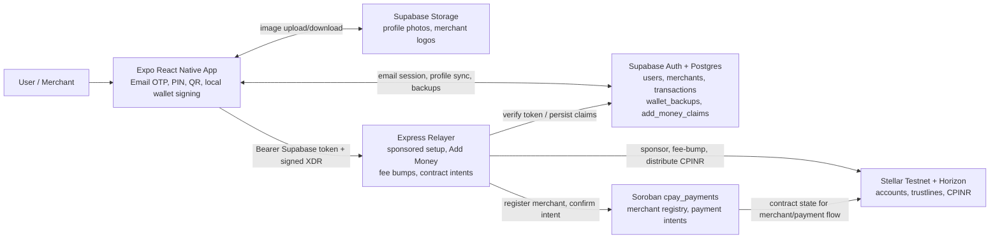
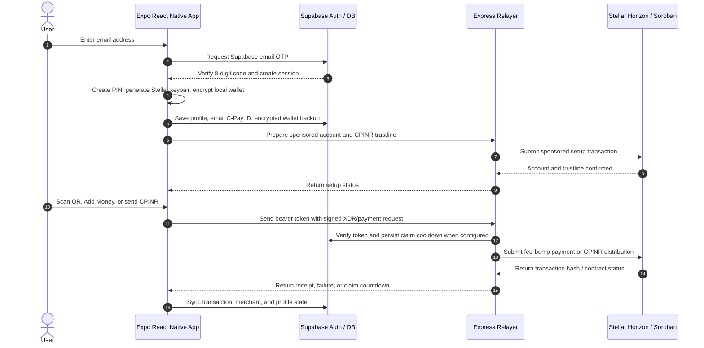

<div align="center">


# C-Pay

### UPI for Stellar - Making Blockchain Payments Simple

[](https://reactnative.dev/)
[](https://expo.dev/)
[](https://stellar.org/)
[](https://soroban.stellar.org/)
[](https://www.typescriptlang.org/)
[](LICENSE)

**Making Stellar payments as simple as scanning a QR code**  
_No crypto knowledge required_

<p align="center">
  <a href="https://expo.dev/accounts/soumen0818/projects/cryptopay/builds/6cbe0d62-37e5-425d-8ee6-8dfcf0acc44d">
    
  </a>
  <a href="#quick-start">
    
  </a>
</p>

</div>

---

## 📋 Table of Contents

<details>
<summary>Click to expand</summary>

- [Overview](#-overview)
- [Download APK](#-download-apk)
- [Current Testnet Values](#-current-testnet-values)
- [Vision](#-vision)
- [Key Features](#-key-features)
- [Architecture](#️-architecture)
  - [System Overview](#system-overview)
  - [User Workflow Architecture](#user-workflow-architecture)
  - [Component Architecture](#component-architecture)
  - [Data Flow](#data-flow)
  - [Database Schema](#database-schema)
- [Project Structure](#-project-structure)
- [Quick Start](#quick-start)
- [Runbook](#-runbook)
  - [Supabase Setup](#1-supabase-setup)
  - [Blockchain Setup](#2-blockchain-setup)
  - [Relayer Setup](#3-relayer-setup)
  - [Mobile App Setup](#4-mobile-app-setup)
- [Environment Reference](#-environment-reference)
- [Components](#-components)
- [Tech Stack](#-tech-stack)
- [How It Works](#-how-it-works)
- [Cost Breakdown](#-cost-breakdown)
- [Security](#-security)
- [Implementation Proof](#-implementation-proof)
- [Useful Commands](#-useful-commands)
- [Troubleshooting](#-troubleshooting)
- [Production Notes](#-production-notes)
- [Roadmap](#-roadmap)
- [Contributing](#-contributing)

</details>

---

## 🎯 Overview

**C-Pay** transforms Stellar payments into a UPI-like experience. Users do not need to understand trustlines, fee bumps, sponsored reserves, contract IDs, or Stellar secret seeds. They verify an email address with Supabase OTP, create a PIN, create an encrypted cloud wallet backup, optionally enable biometrics, use a C-Pay ID, scan QR codes, and pay with CPINR.

### Why C-Pay?

<table>
<tr>
<th>Traditional Crypto Wallets</th>
<th>C-Pay</th>
</tr>
<tr>
<td>

❌ Manual wallet address handling  
❌ Seed phrases exposed to users  
❌ Users pay network fees directly  
❌ Trustlines are confusing  
❌ Merchant flows are separate  
❌ Blockchain concepts appear in the UX

</td>
<td>

✅ Email OTP onboarding now, phone OTP ready for a future SMS provider<br>
✅ 6-digit PIN and optional biometric unlock<br>
✅ Encrypted cloud wallet recovery after reinstall/cache loss<br>
✅ Sponsored Stellar account setup<br>
✅ Relayer handles fees and Add Money<br>
✅ C-Pay IDs and QR codes<br>
✅ UPI-like payment experience

</td>
</tr>
</table>

### 📊 Current Project Snapshot

```text
🌐 Network: Stellar testnet        🪙 Asset: CPINR
📱 Mobile: Expo React Native       🔐 Wallet: Stellar keypair, encrypted locally
🧾 Backend: Express relayer        🗄️ Data: Supabase
🦀 Contract: Soroban Rust          ⚙️ Runtime relayer port: 3000
📧 Auth: Supabase email OTP        ☁️ Recovery: encrypted wallet backup
```

### Closed Pilot Mode

The mobile app is configured for a closed pilot first: users see C-Pay pilot credits, not real INR balances. Production builds should keep `EXPO_PUBLIC_DEV_MODE=false` for real Supabase email OTP while keeping `EXPO_PUBLIC_PILOT_MODE=true` until legal, payment, and operational requirements are ready for public real-money use.

---

## 📱 Download APK

<div align="center">

### Current Stellar Testnet Build

This README does not keep an outdated APK link. Build the current Stellar/CPINR app from `App/` so the APK uses the latest relayer URL, CPINR issuer, and UI changes.

```bash
cd App
npm run build:android:production-apk
```

For both Android and iOS production builds, run:

```bash
cd App
npm run build:production:all
```

The production Android profile creates a release APK. iOS builds are separate artifacts for Apple devices; APK files are Android-only.

> **Note:** This is a closed-pilot testnet app. Use Stellar testnet accounts, testnet XLM, and C-Pay pilot credits only.

</div>

---

## 🌐 Current Testnet Values

These values are public and come from `Blockchain/contract-ids.json`.

| Item | Current Value |
| --- | --- |
| Stellar network | `testnet` |
| Network passphrase | `Test SDF Network ; September 2015` |
| Horizon URL | `https://horizon-testnet.stellar.org` |
| Soroban RPC URL | `https://soroban-testnet.stellar.org` |
| Explorer | `https://stellar.expert/explorer/testnet` |
| Asset | `CPINR:GA2SFZ4GJVMLPULSJMTY7RMIOPQD5W5JGTDSD3N7I2PR5KZRFGPQF5BJ` |
| CPINR issuer public key | `GA2SFZ4GJVMLPULSJMTY7RMIOPQD5W5JGTDSD3N7I2PR5KZRFGPQF5BJ` |
| Stellar Asset Contract ID | `CDR6RDWPZAHOARJKV5YF57VEOE2PJQP6KTE5FGQSJVKLPN5M3KCFE3SN` |
| Stellar Asset Contract Explorer | [Open on Stellar Expert](https://stellar.expert/explorer/testnet/contract/CDR6RDWPZAHOARJKV5YF57VEOE2PJQP6KTE5FGQSJVKLPN5M3KCFE3SN) |
| C-Pay payments contract ID | `CBHYSB5W6TRDTGGYSZUYJBXPPIO7XJS2SLNHJVKWEINOKQC7MKU4N6CR` |
| C-Pay payments contract Explorer | [Open on Stellar Expert](https://stellar.expert/explorer/testnet/contract/CBHYSB5W6TRDTGGYSZUYJBXPPIO7XJS2SLNHJVKWEINOKQC7MKU4N6CR) |
| C-Pay payments Wasm hash | `24522af6d53859f9c453cea65912c4b13000baec04301598b12edc905f084fb9` |
| Contract record updated | `2026-04-27T03:33:54.623Z` |

> **Important:** Public keys and contract IDs are safe to document. Stellar secret seeds beginning with `S` must never be added to the mobile app or committed to source control.

---

## 💡 Vision

### Make Blockchain Payments Invisible

Users should not need to know that a Stellar account, trustline, XDR, fee bump, or Horizon request is involved. Like UPI hides bank routing complexity, C-Pay hides blockchain complexity behind familiar payment patterns.

### The UPI Analogy

<table>
<tr>
<th>Banking Abstraction (UPI)</th>
<th>Stellar Abstraction (C-Pay)</th>
</tr>
<tr>
<td>

🏦 Bank account → VPA  
🔐 Net banking → UPI PIN  
📋 Account number → QR code  
⏰ Slow transfers → Fast settlement  
🏪 Separate POS → Unified merchant QR

</td>
<td>

🔑 Stellar secret → encrypted local wallet  
🔐 Secret signing → PIN/biometric unlock  
📍 Wallet address → C-Pay ID and QR  
⛽ Network fees → relayer fee-bump flow  
🏪 Merchant registry → C-Pay merchant mode

</td>
</tr>
</table>

---

## ✨ Key Features

### 👤 User Features

<details open>
<summary><b>Authentication & Wallet Security</b></summary>

- 📧 **Email OTP Verification** - Active login/onboarding path through Supabase email OTP.
- 🔢 **8-Digit Verification Code** - The verification UI expects the current 8-digit Supabase email code format.
- 🔐 **6-Digit PIN** - Used to encrypt and unlock the local Stellar wallet.
- 👆 **Biometric Unlock** - Optional device biometric backup/unlock through the dedicated biometric setup screen.
- 🔑 **Stellar Wallet** - Device-generated Stellar keypair for each user.
- 🛡️ **Encrypted Storage** - Stellar secret is encrypted before storage in Expo SecureStore.
- ☁️ **Encrypted Cloud Backup** - User creates a recovery password so the Stellar wallet can be restored after app data loss.
- 🧩 **Recovery Password Rules** - Minimum 12 characters with at least 1 uppercase letter, 1 number, and 1 special character.
- 🆔 **C-Pay ID** - UPI-like identifier based on the verified email handle and wallet fingerprint, such as `user@cpayk8f3qz`.
- 👁️ **Wallet Address Reveal** - Full Stellar address is available in profile when needed.
- 🔓 **Key Export** - Profile includes private key and Stellar secret export actions.
- 📵 **Phone OTP Paused** - Phone-number columns and helper functions remain for the future, but the current UI does not offer phone OTP because Twilio/SMS is not enabled for the MVP.

</details>

<details open>
<summary><b>Payments</b></summary>

- 📸 **QR Code Scanning** - Scan user or merchant QR codes.
- 💸 **Send Money** - Send CPINR to Stellar accounts through a signed app transaction.
- 🎁 **Add Money** - Relayer distributes configured CPINR amount from the distribution account.
- ⏱️ **Claim Cooldown** - After a pilot credit claim, users see the remaining time before the next claim.
- ⚡ **Sponsored Fees** - Relayer can submit fee-bump transactions so users do not manage fees directly.
- 📊 **Transaction History** - Local-first transaction records with Supabase sync.
- 🔎 **Explorer Links** - Stellar expert explorer URLs for accounts and transactions.
- 🏦 **Account Readiness** - Relayer sponsors account creation and CPINR trustline setup.

</details>

<details open>
<summary><b>User Experience</b></summary>

- 🎨 **Modern Mobile UI** - Onboarding, PIN, biometric, home, profile, Add Money, and payment screens.
- 🪪 **Profile Management** - Display name, photo, C-Pay ID, wallet address, and key export.
- 🔄 **Change PIN** - Secure PIN update flow.
- 🚪 **Session Management** - Sign out clears in-memory PIN session.
- 📴 **Offline-First Records** - Transactions are saved locally first and synced later.
- 🧭 **Clear Add Money Status** - Add Money shows user feedback instead of silently failing.

</details>

### 🏪 Merchant Features

<details>
<summary><b>Click to expand merchant features</b></summary>

- 🏪 **Merchant Registration** - Business name, owner details, category, address, and wallet.
- ☎️ **Merchant Phone Validation** - Contact phone numbers are normalized and limited to a valid 10-15 digit range.
- 📊 **Merchant Dashboard** - Sales totals, payment insights, and transaction access.
- 📱 **Global Merchant QR** - Reusable QR for receiving CPINR.
- 💵 **Amount QR** - Generate QR codes for a fixed payment amount.
- 📈 **Merchant Transactions** - Dedicated transaction history for business payments.
- 🆔 **Merchant C-Pay ID** - Merchant-friendly display identifier.
- 🔁 **Merchant Restore** - After wallet recovery, merchant details are rehydrated from Supabase by wallet address/auth user.
- ✅ **Merchant Active State** - Contract-side merchant state supports active/inactive behavior.

</details>

### 🌐 Platform Features

- 🚀 **Stellar Testnet Rail** - Current app is built around Stellar testnet CPINR.
- 🧾 **Express Relayer** - Backend handles sponsored setup, Add Money, fee bumps, and status APIs.
- 🧠 **Soroban Contract** - `cpay_payments` stores merchant and payment-intent state.
- 🌐 **Supabase Sync** - Users, merchants, QR codes, transactions, Add Money claims, and encrypted wallet backups.
- 🔒 **Rate Limiting** - Relayer uses request rate limits.
- 🩺 **Health Monitoring** - `/health` reports sponsor XLM and distribution CPINR inventory.
- 🚨 **Low Balance Alerts** - Optional webhook for low sponsor XLM or low CPINR.
- 🧰 **Operator Scripts** - Key generation, testnet CPINR setup, contract build, and contract deploy.

---

## 🏗️ Architecture

### System Overview



### User Workflow Architecture



### Component Architecture

```text
App/
├── App.tsx
├── index.ts
├── src/
│   ├── navigation/             # Stack + tab navigation
│   ├── screens/                # Onboarding, PIN, Home, Profile, Payment, Merchant
│   ├── components/             # Buttons, cards, PIN input, modals, transaction UI
│   ├── services/
│   │   ├── wallet.ts           # Stellar keypair, encrypted wallet, PIN verifier
│   │   ├── blockchain.ts       # Stellar/relayer client
│   │   ├── auth.ts             # OTP and sign-out
│   │   ├── cloudWalletBackup.ts # Encrypted Supabase wallet backup
│   │   ├── storage.ts          # Local + Supabase transaction storage
│   │   ├── merchant.ts         # Merchant database helpers
│   │   └── supabase.ts         # Supabase client
│   ├── utils/
│   │   ├── cpayId.ts           # C-Pay ID generation and lookup
│   │   ├── biometric.ts        # Biometric helpers
│   │   ├── qrCode.ts           # QR payload helpers
│   │   └── paymentAuth.ts      # Payment authorization helpers
│   └── constants/              # Theme and config
│
relayer-service/
├── server.js                   # Express API
├── test-relayer.js             # Health/status test script
└── .env.example                # Backend env template
│
Blockchain/
├── contracts/cpay_payments/    # Rust Soroban contract
├── scripts/create-keypairs.js  # Generate setup keypairs
├── scripts/setup-testnet-asset.js
├── scripts/deploy-contract.js
├── src/config.js
├── src/stellarRail.js
├── test/stellarRail.test.js
└── contract-ids.json
```

### Data Flow

<details open>
<summary><b>New User Setup</b></summary>

```text
Supabase email OTP
  ↓
Create PIN
  ↓
Generate Stellar keypair in app
  ↓
Encrypt Stellar secret with PIN-derived key
  ↓
Save encrypted wallet in SecureStore
  ↓
Save profile + email-based C-Pay ID locally and in Supabase
  ↓
Create encrypted cloud wallet backup with recovery password
  ↓
Optional biometric backup
  ↓
Home screen
```

</details>

<details open>
<summary><b>Restore After Cache Delete/Reinstall</b></summary>

```text
Supabase email OTP
  ↓
App finds existing users row by auth_user_id/email
  ↓
If local SecureStore wallet is missing, app opens RestoreWallet
  ↓
User enters recovery password
  ↓
App fetches wallet_backups row for auth.uid()
  ↓
PIN-independent recovery password decrypts the Stellar secret
  ↓
User creates a new local 6-digit PIN
  ↓
App recreates SecureStore wallet and rehydrates profile/merchant state
```

The cloud backup restores the Stellar wallet. Profile and merchant details come from Supabase rows keyed by `auth_user_id`, email, and wallet address.

</details>

<details open>
<summary><b>Sponsored Account Setup</b></summary>

```text
App calls POST /accounts/prepare
  ↓
Relayer builds sponsor-funded account/trustline transaction
  ↓
App signs user-required operations
  ↓
App calls POST /accounts/submit
  ↓
Relayer submits to Stellar
  ↓
User account can receive CPINR
```

</details>

<details open>
<summary><b>Add Money</b></summary>

```text
User taps Add Money
  ↓
App ensures account + trustline are ready
  ↓
App calls POST /add-money
  ↓
Relayer checks cooldown, amount, distribution CPINR
  ↓
Distribution account sends CPINR to user
  ↓
App saves transaction locally and syncs Supabase
```

</details>

<details open>
<summary><b>Send Money</b></summary>

```text
User enters recipient or scans QR
  ↓
App validates Stellar account and amount
  ↓
App signs CPINR payment XDR locally
  ↓
App calls POST /payments/submit
  ↓
Relayer validates payment and builds fee-bump tx
  ↓
Stellar confirms payment
  ↓
App stores and displays receipt
```

</details>

### Database Schema

```sql
users
  id, auth_user_id, wallet_address, cpay_id, email, phone_number,
  biometric_enabled,
  profile_photo_url, display_name, stellar_network, cpinr_asset_code,
  cpinr_asset_issuer, created_at, updated_at

merchants
  id, auth_user_id, business_name, wallet_address, cpay_id, owner_name, email,
  phone_number, business_address, category, logo_url, is_active,
  total_transactions, total_revenue, stellar_network, cpinr_asset_code,
  cpinr_asset_issuer, created_at, updated_at

transactions
  id, user_id, transaction_id, transaction_type, merchant_id, tx_hash,
  stellar_network, asset_code, asset_issuer, to_address, from_address,
  amount, status, internal_status, user_visible_status, merchant_name,
  note, sender_name, recipient_name, failure_reason, timestamps

merchant_qr_codes
  id, merchant_id, qr_name, amount, asset_code, asset_issuer,
  is_active, scan_count, timestamps

add_money_claims
  id, wallet_address, amount, asset_code, asset_issuer, tx_hash,
  idempotency_key, claimed_at, next_available_at

relayer_idempotency_keys
  key, response, expires_at, created_at

wallet_backups
  id, auth_user_id, wallet_address, backup_version, cipher, kdf,
  kdf_iterations, salt, nonce, ciphertext, created_at, updated_at
```

Run the schema from:

```text
App/supabase_schema.sql
```

Important schema notes:

- `users.email` is the current verified login address. `users.phone_number` stays for a future phone OTP/Twilio rollout.
- `wallet_backups` stores only encrypted wallet material plus cryptographic metadata. It does not store the recovery password or plaintext Stellar secret.
- `wallet_backups` is one row per Supabase `auth.users.id`, enforced by `UNIQUE(auth_user_id)`.
- `add_money_claims` is used by the relayer for persistent pilot-credit cooldowns. Without it, cooldown can still work in relayer memory, but it will not survive restarts or multi-instance deployment.
- `relayer_idempotency_keys` is reserved in the schema; the current relayer code uses an in-memory idempotency cache.
- `get_own_merchant_by_wallet(p_wallet_address)` lets the app restore merchant state after wallet recovery while keeping RLS user-scoped.

---

## 📁 Project Structure

```text
CryptoPay/
├── App/
│   ├── App.tsx
│   ├── app.json
│   ├── eas.json
│   ├── package.json
│   ├── supabase_schema.sql
│   └── src/
│       ├── components/
│       ├── constants/
│       ├── navigation/
│       ├── screens/
│       ├── services/
│       ├── types/
│       └── utils/
│
├── Blockchain/
│   ├── contract-ids.json
│   ├── package.json
│   ├── src/
│   ├── scripts/
│   ├── test/
│   └── contracts/
│       └── cpay_payments/
│           ├── Cargo.toml
│           └── src/lib.rs
│
├── relayer-service/
│   ├── package.json
│   ├── server.js
│   ├── test-relayer.js
│   └── .env.example
│
├── MANUAL_SETUP.md
└── README.md
```

---

## Quick Start

### Prerequisites

```bash
node --version
npm --version
stellar version
rustup target add wasm32v1-none
```

Required tools:

- Node.js 18 or newer
- npm
- Expo through `npm start` or `npx expo`
- Supabase project
- Rust 1.84 or newer
- Stellar CLI v25 or newer
- Android device with Expo Go, Android emulator, iOS simulator, or development build

### Install Dependencies

```bash
cd Blockchain
npm install

cd ../relayer-service
npm install

cd ../App
npm install
```

### Run Locally

Terminal 1:

```bash
cd relayer-service
npm start
```

Terminal 2:

```bash
cd App
npx expo start --clear
```

Do not run:

```bash
npm expo start
```

`expo` is not an npm command. Use `npm start` from `App/` or `npx expo start`.

---

## 🧭 Runbook

### 1. Supabase Setup

1. Create a Supabase project.
2. Copy the project URL into `App/.env` as `EXPO_PUBLIC_SUPABASE_URL`.
3. Copy the anon/publishable key into `App/.env` as `EXPO_PUBLIC_SUPABASE_ANON_KEY`.
4. Do not put the service-role key in the Expo app.
5. Run the SQL in `App/supabase_schema.sql`.
6. Enable Supabase email OTP for Auth. The app uses email OTP for onboarding/login and expects an 8-digit code in the UI.
7. Add `email` to the `users` table by running the current schema if your project was created before the email-auth change.
8. Keep phone auth/SMS disabled until the Twilio or other SMS subscription is ready. The phone column remains for future migration.
9. For relayer persistence and token verification, put the service-role key only in the relayer environment as `SUPABASE_SERVICE_ROLE_KEY`.
10. For local development only, set `EXPO_PUBLIC_DEV_MODE=true` if you are testing legacy dev-only auth helpers. Production/internal pilot builds should keep it `false`.

### 2. Blockchain Setup

```bash
cd Blockchain
cp .env.example .env
npm run create:keypairs
```

The keypair script prints:

- `ASSET_ISSUER_PUBLIC_KEY` and `ASSET_ISSUER_SECRET`
- `ASSET_DISTRIBUTION_PUBLIC_KEY` and `ASSET_DISTRIBUTION_SECRET`
- `CONTRACT_ADMIN_PUBLIC_KEY` and `CONTRACT_ADMIN_SECRET`
- `RELAYER_PUBLIC_KEY` and `RELAYER_SECRET`

Create the Stellar CLI deployer identity:

```bash
stellar keys generate cpay-deployer --fund
stellar keys public-key cpay-deployer
```

Testnet asset setup:

```text
STELLAR_NETWORK=testnet
STELLAR_HORIZON_URL=https://horizon-testnet.stellar.org
STELLAR_NETWORK_PASSPHRASE=Test SDF Network ; September 2015
ASSET_CODE=CPINR
ASSET_ISSUER_PUBLIC_KEY=<issuer public key>
ASSET_DISTRIBUTION_PUBLIC_KEY=<distribution public key>
ASSET_ISSUER_SECRET=<issuer secret>
ASSET_DISTRIBUTION_SECRET=<distribution secret>
INITIAL_SUPPLY=1000000000
TRUSTLINE_LIMIT=1000000000
LOCK_ISSUER_AFTER_SETUP=false
```

Run:

```bash
npm run setup:testnet
```

Contract deployment values:

```text
SOROBAN_RPC_URL=https://soroban-testnet.stellar.org
SOROBAN_NETWORK_PASSPHRASE=Test SDF Network ; September 2015
STELLAR_CLI_NETWORK=testnet
STELLAR_CLI_SOURCE_ACCOUNT=cpay-deployer
CONTRACT_ADMIN_PUBLIC_KEY=<contract admin public key>
RELAYER_PUBLIC_KEY=<contract relayer public key>
```

Build and deploy:

```bash
npm run contract:build
npm run deploy:contract
```

The deploy script writes:

```text
Blockchain/contract-ids.json
```

### 3. Relayer Setup

```bash
cd relayer-service
cp .env.example .env
```

Minimum local env:

```text
PORT=3000
NODE_ENV=development
CORS_ORIGIN=*

STELLAR_NETWORK=testnet
STELLAR_HORIZON_URL=https://horizon-testnet.stellar.org
STELLAR_NETWORK_PASSPHRASE=Test SDF Network ; September 2015
STELLAR_BASE_FEE=100

SOROBAN_RPC_URL=https://soroban-testnet.stellar.org
TOKEN_CONTRACT_ID=CDR6RDWPZAHOARJKV5YF57VEOE2PJQP6KTE5FGQSJVKLPN5M3KCFE3SN
CPAY_CONTRACT_ID=CBHYSB5W6TRDTGGYSZUYJBXPPIO7XJS2SLNHJVKWEINOKQC7MKU4N6CR
CONTRACT_FLOW_ENABLED=true
CONTRACT_INTENT_TTL_SECONDS=600

CPINR_ASSET_CODE=CPINR
CPINR_ASSET_ISSUER=GA2SFZ4GJVMLPULSJMTY7RMIOPQD5W5JGTDSD3N7I2PR5KZRFGPQF5BJ

SPONSOR_SECRET=<sponsor secret seed>
DISTRIBUTION_SECRET=<distribution secret seed>
RELAYER_SECRET=<contract relayer secret seed>
CONTRACT_ADMIN_SECRET=<contract admin secret seed>

STARTING_BALANCE=1.5
TRUSTLINE_LIMIT=1000000000
FEE_BUMP_MULTIPLIER=10
TRANSACTION_TIMEOUT_SECONDS=60

ENABLE_ADD_MONEY=true
ADD_MONEY_AMOUNT=100
MAX_ADD_MONEY_AMOUNT=1000
ADD_MONEY_COOLDOWN_MS=86400000
MAX_PAYMENT_AMOUNT=100000
IDEMPOTENCY_TTL_MS=600000

RELAYER_AUTH_REQUIRED=false
SUPABASE_URL=
SUPABASE_SERVICE_ROLE_KEY=
SUPABASE_JWT_SECRET=
RATE_LIMIT_WINDOW_MS=60000
RATE_LIMIT_MAX_REQUESTS=100
LOW_XLM_THRESHOLD=5
LOW_CPINR_THRESHOLD=1000
ALERT_WEBHOOK_URL=
```

Start:

```bash
npm start
```

Health:

```text
http://localhost:3000/health
```

Healthy Add Money requires:

```json
{
  "status": "healthy",
  "lowXlm": false,
  "lowAsset": false,
  "distributionCpinrBalance": "1000000000.0000000"
}
```

If `distributionCpinrBalance` is `0`, Add Money will fail even if the relayer status is healthy.

For deployed or authenticated relayer requests, use one of these auth setups:

- Recommended now: set `RELAYER_AUTH_REQUIRED=true`, `SUPABASE_URL`, and `SUPABASE_SERVICE_ROLE_KEY`. The relayer verifies the app's Supabase access token through Supabase Auth and also uses the service-role key to persist Add Money claim cooldowns.
- Legacy HS256 only: set `RELAYER_AUTH_REQUIRED=true` and `SUPABASE_JWT_SECRET` if your Supabase project still issues HS256 JWTs.
- MVP testing only: set `RELAYER_AUTH_REQUIRED=false`. This bypasses relayer auth and should not be used for public production.

### 4. Mobile App Setup

```bash
cd App
cp .env.example .env
```

Minimum env:

```text
EXPO_PUBLIC_SUPABASE_URL=<your Supabase project URL>
EXPO_PUBLIC_SUPABASE_ANON_KEY=<your Supabase anon key>

EXPO_PUBLIC_STELLAR_NETWORK=testnet
EXPO_PUBLIC_STELLAR_HORIZON_URL=https://horizon-testnet.stellar.org
EXPO_PUBLIC_STELLAR_NETWORK_PASSPHRASE=Test SDF Network ; September 2015
EXPO_PUBLIC_STELLAR_BASE_FEE=100
EXPO_PUBLIC_STELLAR_EXPLORER_URL=https://stellar.expert/explorer/testnet

EXPO_PUBLIC_CPINR_ASSET_CODE=CPINR
EXPO_PUBLIC_CPINR_ASSET_ISSUER=GA2SFZ4GJVMLPULSJMTY7RMIOPQD5W5JGTDSD3N7I2PR5KZRFGPQF5BJ

EXPO_PUBLIC_STELLAR_RELAYER_URL=http://<your computer LAN IP>:3000

EXPO_PUBLIC_PILOT_MODE=true
EXPO_PUBLIC_PILOT_CREDIT_NAME=C-Pay pilot credits
EXPO_PUBLIC_PILOT_CREDIT_UNIT=credits
EXPO_PUBLIC_PILOT_CREDIT_SYMBOL=Cr
EXPO_PUBLIC_PILOT_ACCESS_CODE=

EXPO_PUBLIC_DEV_MODE=false
# Legacy/dev-only; the active MVP login screen uses email OTP
EXPO_PUBLIC_DEV_PHONE=+911234567890
EXPO_PUBLIC_DEV_OTP=123456
```

For your current Wi-Fi output, the phone-reachable local relayer URL is:

```text
http://172.29.78.86:3000
```

Use it in `App/.env`:

```text
EXPO_PUBLIC_STELLAR_RELAYER_URL=http://172.29.78.86:3000
```

Restart Expo after changing env:

```bash
npx expo start --clear
```

---

## 🔧 Environment Reference

### 📱 App Public Variables

| Variable | Required | Description |
| --- | --- | --- |
| `EXPO_PUBLIC_SUPABASE_URL` | Yes | Supabase project URL |
| `EXPO_PUBLIC_SUPABASE_ANON_KEY` | Yes | Supabase anon/publishable key |
| `EXPO_PUBLIC_STELLAR_NETWORK` | Yes | `testnet` or `public` |
| `EXPO_PUBLIC_STELLAR_HORIZON_URL` | Yes | Stellar Horizon endpoint |
| `EXPO_PUBLIC_STELLAR_NETWORK_PASSPHRASE` | Yes | Stellar passphrase |
| `EXPO_PUBLIC_STELLAR_BASE_FEE` | Yes | Base fee in stroops |
| `EXPO_PUBLIC_STELLAR_EXPLORER_URL` | Yes | Stellar explorer base URL |
| `EXPO_PUBLIC_CPINR_ASSET_CODE` | Yes | `CPINR` |
| `EXPO_PUBLIC_CPINR_ASSET_ISSUER` | Yes | CPINR issuer public key |
| `EXPO_PUBLIC_STELLAR_RELAYER_URL` | Yes for real device/builds | Relayer URL reachable from the app |
| `EXPO_PUBLIC_PILOT_MODE` | Optional | Keep `true` for closed-pilot/test-credit UX |
| `EXPO_PUBLIC_PILOT_CREDIT_NAME` | Optional | User-facing pilot credit name |
| `EXPO_PUBLIC_PILOT_CREDIT_UNIT` | Optional | User-facing unit label, defaults to `credits` |
| `EXPO_PUBLIC_PILOT_CREDIT_SYMBOL` | Optional | Compact balance symbol, defaults to `Cr` |
| `EXPO_PUBLIC_PILOT_ACCESS_CODE` | Optional | Soft invite gate shown before OTP; not a backend secret |
| `EXPO_PUBLIC_DEV_MODE` | Optional | Development mode flag |
| `EXPO_PUBLIC_DEV_PHONE` | Optional | Legacy/dev-only fallback phone; not used by the active email OTP screen |
| `EXPO_PUBLIC_DEV_OTP` | Optional | Legacy/dev-only fallback OTP; not used by the active email OTP screen |

### 🧾 Relayer Backend Variables

| Variable | Required | Description |
| --- | --- | --- |
| `PORT` | No | Defaults to `3000` |
| `CORS_ORIGIN` | No | Use `*` locally, restrict in production |
| `STELLAR_NETWORK` | Yes | `testnet` or `public` |
| `STELLAR_HORIZON_URL` | Yes | Stellar Horizon endpoint |
| `STELLAR_NETWORK_PASSPHRASE` | Yes | Stellar network passphrase |
| `CPINR_ASSET_CODE` | Yes | `CPINR` |
| `CPINR_ASSET_ISSUER` | Yes | CPINR issuer public key |
| `SPONSOR_SECRET` | Yes | Sponsor account secret seed |
| `DISTRIBUTION_SECRET` | Yes | Distribution account secret seed |
| `SOROBAN_RPC_URL` | Contract flow | Soroban RPC endpoint |
| `TOKEN_CONTRACT_ID` | Contract flow | Stellar Asset Contract ID for CPINR |
| `CPAY_CONTRACT_ID` | Contract flow | Deployed C-Pay payments contract ID |
| `CONTRACT_FLOW_ENABLED` | No | Enables merchant payment intent flow when contract env is present |
| `CONTRACT_INTENT_TTL_SECONDS` | No | Payment intent expiry window, defaults to 600 seconds |
| `RELAYER_SECRET` | Contract confirmation | Secret seed matching the contract relayer public key |
| `CONTRACT_ADMIN_SECRET` | Merchant sync | Secret seed matching the contract admin public key |
| `STARTING_BALANCE` | Yes | XLM for sponsored user account creation |
| `TRUSTLINE_LIMIT` | Yes | CPINR trustline limit |
| `FEE_BUMP_MULTIPLIER` | Yes | Fee-bump max fee multiplier |
| `TRANSACTION_TIMEOUT_SECONDS` | Yes | Stellar transaction timeout |
| `ENABLE_ADD_MONEY` | No | Defaults to enabled on testnet and disabled on public |
| `ADD_MONEY_AMOUNT` | Yes | Default Add Money amount |
| `MAX_ADD_MONEY_AMOUNT` | Yes | Maximum Add Money API amount |
| `ADD_MONEY_COOLDOWN_MS` | Yes | Per-account Add Money cooldown |
| `MAX_PAYMENT_AMOUNT` | Yes | Maximum payment amount |
| `IDEMPOTENCY_TTL_MS` | Yes | Duplicate request cache lifetime |
| `RELAYER_AUTH_REQUIRED` | No | Defaults to true on public network |
| `SUPABASE_URL` | Recommended when auth/persistence is enabled | Supabase project URL for Auth API verification and REST persistence |
| `SUPABASE_SERVICE_ROLE_KEY` | Recommended when auth/persistence is enabled | Server-only key for Supabase Auth API verification and Add Money persistence; never place this in the app |
| `SUPABASE_JWT_SECRET` | Legacy HS256 auth only | Verifies older HS256 Supabase access tokens when Auth API verification is not used |
| `RATE_LIMIT_WINDOW_MS` | Yes | Rate limit window |
| `RATE_LIMIT_MAX_REQUESTS` | Yes | Rate limit count |
| `LOW_XLM_THRESHOLD` | Yes | Sponsor XLM warning threshold |
| `LOW_CPINR_THRESHOLD` | Yes | Distribution CPINR warning threshold |
| `ALERT_WEBHOOK_URL` | Optional | Low-balance alert webhook |

### 🦀 Blockchain Variables

| Variable | Required | Description |
| --- | --- | --- |
| `STELLAR_NETWORK` | Yes | `testnet` or `public` |
| `STELLAR_HORIZON_URL` | Yes | Horizon endpoint |
| `STELLAR_NETWORK_PASSPHRASE` | Yes | Network passphrase |
| `SOROBAN_RPC_URL` | Deploy | Soroban RPC URL |
| `SOROBAN_NETWORK_PASSPHRASE` | Deploy | Soroban passphrase |
| `STELLAR_CLI_NETWORK` | Deploy | Stellar CLI network alias |
| `STELLAR_CLI_SOURCE_ACCOUNT` | Deploy | CLI identity such as `cpay-deployer` |
| `ASSET_CODE` | Yes | `CPINR` |
| `ASSET_ISSUER_PUBLIC_KEY` | Yes | Issuer public key |
| `ASSET_DISTRIBUTION_PUBLIC_KEY` | Setup | Distribution public key |
| `ASSET_ISSUER_SECRET` | Testnet setup | Issuer secret seed |
| `ASSET_DISTRIBUTION_SECRET` | Testnet setup | Distribution secret seed |
| `CONTRACT_ADMIN_PUBLIC_KEY` | Deploy | Contract admin public key |
| `RELAYER_PUBLIC_KEY` | Deploy | Contract relayer public key |
| `TOKEN_CONTRACT_ID` | Optional | Existing Stellar Asset Contract ID |
| `CPAY_CONTRACT_ID` | Optional | Existing C-Pay contract ID |
| `INITIAL_SUPPLY` | Setup | CPINR amount issued to distribution |
| `TRUSTLINE_LIMIT` | Setup | Distribution trustline limit |
| `LOCK_ISSUER_AFTER_SETUP` | Optional | Lock issuer master key after setup |

---

## 🧩 Components

### Mobile Screens

<details>
<summary><b>Onboarding & Auth</b></summary>

- `SplashScreen`
- `OnboardingScreen`
- `PhoneVerificationScreen`
- `CreatePINScreen`
- `ConfirmPINScreen`
- `ProfileSetupScreen`
- `CloudBackupSetupScreen`
- `BiometricSetupScreen`
- `RestoreWalletScreen`
- `LoginScreen`
- `ForgotPINScreen`
- `ChangePINScreen`

</details>

<details>
<summary><b>Payments & Wallet</b></summary>

- `HomeScreen`
- `SendMoneyScreen`
- `ScanScreen`
- `PaymentConfirmScreen`
- `PaymentProcessingScreen`
- `PaymentSuccessScreen`
- `PaymentFailureScreen`
- `TransactionHistoryScreen`
- `QRGeneratorScreen`
- `ProfileScreen`

</details>

<details>
<summary><b>Merchant</b></summary>

- `MerchantRegistrationScreen`
- `MerchantDashboardScreen`
- `MerchantQRGeneratorScreen`
- `MerchantGlobalQRScreen`
- `MerchantTransactionsScreen`

</details>

### Relayer Endpoints

| Method | Endpoint | Purpose |
| --- | --- | --- |
| `GET` | `/` | Service information |
| `GET` | `/health` | Health and inventory |
| `GET` | `/account/:accountId/status` | Account and trustline readiness |
| `GET` | `/account/:accountId/balance` | CPINR and XLM balance |
| `POST` | `/accounts/prepare` | Build sponsored setup transaction |
| `POST` | `/accounts/submit` | Submit signed setup transaction |
| `GET` | `/contract/config` | Read deployed C-Pay contract config |
| `POST` | `/contract/merchants/register` | Sync merchant ID and account to Soroban |
| `POST` | `/payments/intents/prepare` | Build user-signed contract payment intent transaction |
| `POST` | `/payments/intents/submit` | Submit signed contract payment intent transaction |
| `POST` | `/payments/submit` | Validate and submit fee-bump payment, then confirm contract intent when supplied |
| `POST` | `/add-money` | Send CPINR from distribution |
| `GET` | `/tx/:hash` | Transaction status |

### Soroban Contract Functions

| Function | Purpose |
| --- | --- |
| `__constructor` | Initialize admin, token, relayer |
| `config` | Read contract config |
| `set_admin` | Rotate admin |
| `set_token` | Update token contract |
| `set_relayer` | Rotate relayer |
| `set_paused` | Pause or unpause contract workflow |
| `register_merchant` | Add merchant account |
| `set_merchant_account` | Rotate merchant account without overwriting registration |
| `set_merchant_active` | Enable or disable merchant |
| `merchant` | Read merchant record |
| `create_intent` | Create payment intent with bounded expiry |
| `confirm_intent` | Relayer confirms payment hash |
| `cancel_intent` | Payer cancels intent |
| `intent` | Read intent |
| `extend_ttl` | Extend instance TTL |

---

## 🛠️ Tech Stack

<table>
<tr>
<th>Layer</th>
<th>Technology</th>
<th>Purpose</th>
</tr>
<tr>
<td>Mobile</td>
<td>Expo, React Native, TypeScript</td>
<td>Android/iOS app experience</td>
</tr>
<tr>
<td>Wallet</td>
<td>@stellar/stellar-base, SecureStore, noble crypto</td>
<td>Stellar keypair, local signing, encrypted storage, cloud-backup encryption</td>
</tr>
<tr>
<td>Backend</td>
<td>Node.js, Express, @stellar/stellar-sdk</td>
<td>Relayer, fee bumps, Add Money, sponsored setup</td>
</tr>
<tr>
<td>Blockchain</td>
<td>Stellar testnet, Horizon, Soroban</td>
<td>CPINR balances, transactions, payment-intent contract</td>
</tr>
<tr>
<td>Contract</td>
<td>Rust, soroban-sdk</td>
<td>Merchant registry and payment intent state</td>
</tr>
<tr>
<td>Database</td>
<td>Supabase Postgres</td>
<td>Auth-linked users, merchants, QR codes, transaction records, encrypted wallet backups</td>
</tr>
</table>

---

## 🔄 How It Works

### Wallet Creation

```text
6-digit PIN entered by user
  ↓
Stellar keypair generated on device
  ↓
Secret encrypted with XChaCha20-Poly1305
  ↓
PIN verifier stored separately
  ↓
Encrypted wallet saved in SecureStore
```

### Cloud Wallet Backup

```text
Recovery password entered by user
  ↓
Rules checked: 12+ chars, uppercase, number, special character
  ↓
PBKDF2-SHA256 derives a 32-byte key with 120000 iterations
  ↓
Stellar secret is encrypted with XChaCha20-Poly1305
  ↓
Supabase wallet_backups stores salt, nonce, ciphertext, kdf metadata
```

The recovery password is never stored. Supabase stores only encrypted ciphertext and metadata needed to derive the key again during restore.

### C-Pay ID

```text
verified email handle + wallet fingerprint
  ↓
user@cpayk8f3qz
```

The C-Pay ID is for display and lookup. Stellar payments still settle to real Stellar account IDs.

### Relayer Policy

```text
STARTING_BALANCE=1.5
TRUSTLINE_LIMIT=1000000000
ADD_MONEY_AMOUNT=100
MAX_ADD_MONEY_AMOUNT=1000
ADD_MONEY_COOLDOWN_MS=86400000
MAX_PAYMENT_AMOUNT=100000
```

These policy values are backend `.env` values used by `relayer-service/server.js`, not Rust contract constants.

---

## 💰 Cost Breakdown

### Local/Testnet

| Item | Cost | Notes |
| --- | --- | --- |
| Stellar testnet XLM | Free | Fund test accounts with Friendbot or `stellar keys generate --fund` |
| CPINR test asset | Free | Issued by the testnet issuer account |
| Soroban testnet deployment | Free testnet funds | Uses Stellar CLI deployer identity |
| Supabase local testing | Free tier possible | Depends on project usage |
| Expo development | Free locally | EAS builds depend on Expo account limits |
| Relayer local run | Free | Runs on your machine on port `3000` |

### Production

| Item | Cost Driver |
| --- | --- |
| Stellar public network | Real XLM reserves and transaction fees |
| Relayer hosting | Server/container hosting and HTTPS |
| Supabase | Database/storage/auth usage |
| Email OTP | Supabase Auth email usage and configured SMTP, if custom SMTP is used |
| SMS OTP future | SMS provider cost through Supabase phone auth when Twilio/SMS is enabled later |
| Monitoring | Logs, alerts, uptime checks |
| Custody/security | Secret management, multisig, operational process |

---

## 🔐 Security

### Mobile

- Stellar secret is generated on device.
- Stellar secret is encrypted before storage.
- Raw PIN is not persisted in AsyncStorage.
- PIN verifier uses PBKDF2-SHA256.
- Wallet encryption uses XChaCha20-Poly1305.
- Cloud wallet backup uses a separate recovery-password-derived key.
- Cloud backup KDF uses PBKDF2-SHA256 with 120000 iterations.
- Cloud backup stores ciphertext, salt, nonce, and metadata in Supabase, not the recovery password.
- Biometric backup is optional and device-local.
- Sign out clears the in-memory PIN session.

### Backend

- `SPONSOR_SECRET` and `DISTRIBUTION_SECRET` stay in relayer infrastructure only.
- Relayer validates signed payment XDR before submission.
- Relayer only accepts the configured CPINR asset.
- Relayer rejects invalid accounts, invalid XDR, and over-limit amounts.
- Express rate limiting protects public endpoints.
- When enabled, relayer auth verifies Supabase access tokens before protected requests.
- `SUPABASE_SERVICE_ROLE_KEY` is server-only and is used by the relayer for Auth API verification and Add Money claim persistence.
- Low-balance health flags help detect sponsor/distribution inventory problems.

### Blockchain

- Issuer secret should be moved to cold custody after setup.
- Contract admin should be protected with secure custody or multisig.
- Relayer account can confirm payment intents but should not be a user wallet.
- Production public network must use real custody and monitoring.

---

## ✅ Implementation Proof

The README details above are tied to the current code paths:

| Area | Evidence in repo |
| --- | --- |
| Email OTP onboarding | `App/src/screens/PhoneVerificationScreen.tsx` uses `sendLoginEmailOTP`, `verifyLoginEmailOTP`, and an 8-digit OTP input. |
| Supabase email auth helper | `App/src/services/auth.ts` calls `supabase.auth.signInWithOtp({ email })` and verifies with `type: 'email'`. |
| Local wallet encryption | `App/src/services/wallet.ts` uses `PBKDF2-SHA256` and `XChaCha20-Poly1305` before writing the wallet to SecureStore. |
| Cloud backup encryption | `App/src/services/cloudWalletBackup.ts` uses `CLOUD_BACKUP_KDF_ITERATIONS = 120000`, `pbkdf2-sha256`, `xchacha20-poly1305`, random salt, random nonce, and Supabase `wallet_backups`. |
| Recovery password rules | `App/src/services/cloudWalletBackup.ts` checks length, uppercase, number, and special-character rules; `CloudBackupSetupScreen` shows them inline. |
| Restore after data loss | `App/src/screens/RestoreWalletScreen.tsx` restores the encrypted cloud backup, asks for a new local PIN, and recreates the local wallet. |
| Merchant restore | `App/src/services/merchant.ts` calls `get_own_merchant_by_wallet`; merchant dashboard/QR/transactions reload merchant state by restored wallet address. |
| Supabase schema | `App/supabase_schema.sql` defines `email`, `auth_user_id`, `wallet_backups`, `add_money_claims`, RLS policies, and merchant recovery RPCs. |
| Relayer auth and persistence | `relayer-service/server.js` verifies Supabase bearer tokens and persists Add Money claims through Supabase REST when service-role env is configured. |
| Production APK/iOS build config | `App/eas.json` production profile builds Android APK and iOS device artifacts; `App/package.json` exposes production build scripts. |
| Media permission fix | `App/app.json` configures `expo-media-library` with `granularPermissions: ["photo"]`. |

Recommended local verification commands after code changes:

```bash
cd App
npx expo install --check
npx tsc --noEmit

cd ../relayer-service
node --check server.js
```

---

## 🧪 Useful Commands

### Blockchain

```bash
cd Blockchain
npm test
npm run create:keypairs
npm run setup:testnet
npm run contract:build
npm run deploy:contract
```

### Relayer

```bash
cd relayer-service
npm start
node test-relayer.js
curl http://localhost:3000/health
```

### App

```bash
cd App
npm start
npx expo start --clear
npx tsc --noEmit
```

### Phone URL

```bash
ip addr show wlan0
```

Use:

```text
http://<your laptop LAN IP>:3000/health
```

For your shown Wi-Fi IP:

```text
http://172.29.78.86:3000/health
```

---

## 🩺 Troubleshooting

<details open>
<summary><b>Stellar CLI says: Failed to find config identity for cpay-deployer</b></summary>

Create and fund the CLI identity:

```bash
stellar keys generate cpay-deployer --fund
```

Then rerun:

```bash
cd Blockchain
npm run deploy:contract
```

</details>

<details open>
<summary><b>Deploy says optimized wasm file does not exist</b></summary>

The deploy script checks both:

- `target/stellar/cpay_payments.optimized.wasm`
- `target/stellar/cpay_payments.wasm`

Rebuild from the latest code:

```bash
cd Blockchain
npm run contract:build
npm run deploy:contract
```

</details>

<details open>
<summary><b>Browser shows Cannot GET</b></summary>

Use:

```text
http://localhost:3000/health
```

The current relayer also returns service information at `/`. If `/` still shows `Cannot GET`, restart the relayer so the latest `server.js` is running.

</details>

<details open>
<summary><b>Expo phone app shows Network request failed</b></summary>

Most likely the phone cannot reach the relayer URL.

Check:

- Phone and laptop are on the same Wi-Fi.
- Relayer is running on port `3000`.
- Phone browser can open `http://<LAN-IP>:3000/health`.
- Firewall allows port `3000`.
- `App/.env` uses `EXPO_PUBLIC_STELLAR_RELAYER_URL`.
- Expo was restarted after env changes.

For a real phone, avoid `localhost`. Use your laptop IP, for example:

```text
EXPO_PUBLIC_STELLAR_RELAYER_URL=http://172.29.78.86:3000
```

</details>

<details open>
<summary><b>Add Money fails while health says healthy</b></summary>

`status: "healthy"` means the process can run and read Stellar. Add Money also needs CPINR inventory.

Check:

- `distributionCpinrBalance`
- `lowAsset`
- `sponsorXlmBalance`
- `lowXlm`

If `distributionCpinrBalance` is `0`, issue CPINR to the distribution account or run the testnet asset setup with the distribution account used by the relayer.

</details>

<details open>
<summary><b>Add Money says Unsupported authentication token</b></summary>

The app sends the current Supabase access token to the relayer. This error means the relayer could not verify that token.

Check:

- User completed email OTP login and has a current Supabase session.
- The deployed relayer has `RELAYER_AUTH_REQUIRED=true`.
- Preferred config is set on the relayer: `SUPABASE_URL` and `SUPABASE_SERVICE_ROLE_KEY`.
- If you use old HS256 JWT verification, `SUPABASE_JWT_SECRET` matches the Supabase project.
- Relayer was restarted after env changes.
- `/health` shows `authApiConfigured: true` when using the Supabase Auth API path.

For MVP testing only, `RELAYER_AUTH_REQUIRED=false` bypasses this check.

</details>

<details open>
<summary><b>Email verification code does not arrive</b></summary>

The current MVP login uses Supabase email OTP, not phone OTP.

Check:

- Supabase Auth email provider is enabled.
- The project email template sends the OTP token, not only a magic-link URL.
- The app's OTP input expects 8 digits, so Supabase Auth should be configured to send 8-digit OTP codes.
- `EXPO_PUBLIC_SUPABASE_URL` and `EXPO_PUBLIC_SUPABASE_ANON_KEY` point to the same Supabase project where the SQL schema was run.
- Spam/junk folder and Supabase Auth logs.
- Expo was restarted after env changes.

</details>

<details open>
<summary><b>After clearing app data, profile looks new</b></summary>

AsyncStorage and SecureStore are local app data. Clearing app data removes the local PIN verifier, local profile cache, and local encrypted wallet. The future-proof path is the encrypted cloud backup:

- Verify the same email with Supabase OTP.
- Enter the recovery password created on `CloudBackupSetupScreen`.
- Create a new local 6-digit PIN.
- The app restores the Stellar wallet, then reloads profile and merchant rows from Supabase.

If the recovery password was never created or is lost, the cloud backup cannot be decrypted because the password is not stored by the app or Supabase.

</details>

<details open>
<summary><b>QR download media-library error in Expo Go</b></summary>

Expo Go cannot provide every production Android media-library permission on newer Android versions. The app config already requests photo-only access with:

```json
"granularPermissions": ["photo"]
```

Build and test a development or production build:

```bash
cd App
npm run build:android:production-apk
```

</details>

<details open>
<summary><b>Balance is always zero</b></summary>

Check:

- `EXPO_PUBLIC_CPINR_ASSET_ISSUER` equals `GA2SFZ4GJVMLPULSJMTY7RMIOPQD5W5JGTDSD3N7I2PR5KZRFGPQF5BJ`.
- User account exists on Stellar.
- User account has a CPINR trustline.
- Relayer `/account/<wallet>/balance` returns a CPINR balance.
- Expo was restarted with `npx expo start --clear`.

</details>

<details open>
<summary><b>Phone OTP is missing from the screen</b></summary>

That is expected for the MVP. The active verification path is Supabase email OTP. Phone-number columns and helper functions remain in the codebase so phone OTP can be enabled later after Twilio/SMS provider setup.

</details>

---

## 🚢 Production Notes

- Deploy the relayer behind HTTPS before distributing builds.
- Set `EXPO_PUBLIC_STELLAR_RELAYER_URL` to the deployed HTTPS backend URL for EAS builds.
- Store relayer secrets in infrastructure secrets, not in source files.
- Restrict `CORS_ORIGIN`.
- Set `RELAYER_AUTH_REQUIRED=true` for production/public-network relayer deployments.
- Prefer `SUPABASE_URL` plus `SUPABASE_SERVICE_ROLE_KEY` on the relayer for Supabase Auth API token verification and Add Money claim persistence.
- Use `SUPABASE_JWT_SECRET` only when your Supabase project still uses legacy HS256 JWT verification.
- Keep `ENABLE_ADD_MONEY=false` on public network unless you have a real abuse-resistant funding policy.
- Monitor sponsor XLM and distribution CPINR.
- Keep issuer/admin secrets offline or protected by multisig.
- Apply `App/supabase_schema.sql` after this update to replace the old permissive Supabase RLS policies with user-scoped policies and limited lookup RPCs.
- Keep phone OTP disabled until an SMS provider such as Twilio is configured; email OTP is the current production-pilot path.
- Store and rotate EAS build env values in EAS/project secrets when moving beyond internal testing.
- Use a reliable public-network Horizon/Soroban RPC provider for production.
- Update README, `.env` files, app config, and EAS env after redeploying contracts.

---

## 🗺️ Roadmap

### Phase 1 - Current Stellar Testnet Rail

- ✅ Expo app onboarding, PIN, biometric, profile, wallet storage
- ✅ Supabase email OTP onboarding with phone OTP paused for future SMS provider setup
- ✅ Encrypted cloud wallet backup and restore after app data loss
- ✅ CPINR issued asset on Stellar testnet
- ✅ Sponsored account and trustline setup
- ✅ Add Money through relayer distribution account
- ✅ Fee-bump payment submission
- ✅ Merchant screens and QR flows
- ✅ Merchant profile restore after wallet recovery
- ✅ Soroban payment-intent contract deployment

### Phase 2 - Backend Contract Integration

- ✅ Backend API for contract-backed merchant payment intents
- ✅ Merchant registration sync to Soroban
- ✅ Relayer confirmation of contract intents after Stellar payment submission
- ⏳ Better relayer inventory dashboard

### Phase 3 - Production Readiness

- ✅ User-scoped Supabase RLS baseline
- ⏳ HTTPS relayer deployment
- ⏳ Secret rotation and custody runbook
- ⏳ Monitoring and alerting
- ⏳ Public-network migration plan

---

## 🤝 Contributing

1. Keep mobile app secrets out of `App/.env`.
2. Keep Stellar `S...` secret seeds out of committed docs and source.
3. Update `Blockchain/contract-ids.json` after contract redeployments.
4. Update this README whenever network, issuer, contract, or relayer details change.
5. Run the relevant checks before sharing a build.

---

<div align="center">

**C-Pay: UPI-like payments on Stellar**

Made for simple CPINR payments, sponsored setup, QR flows, and merchant-ready Stellar UX.

</div>
